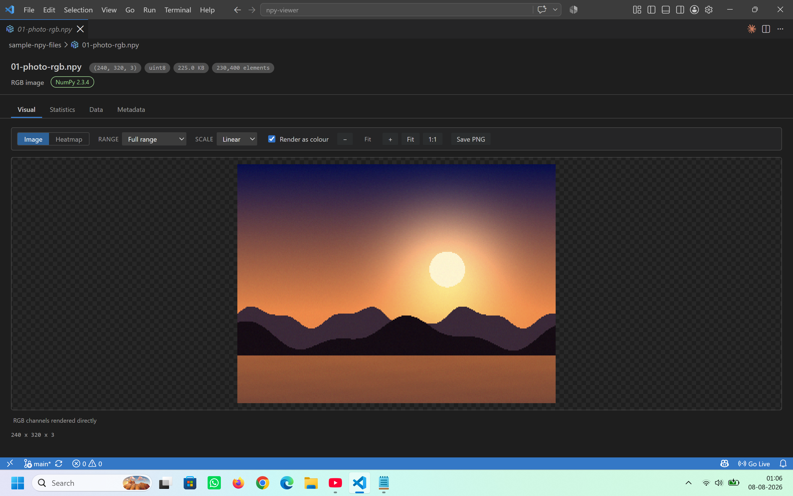
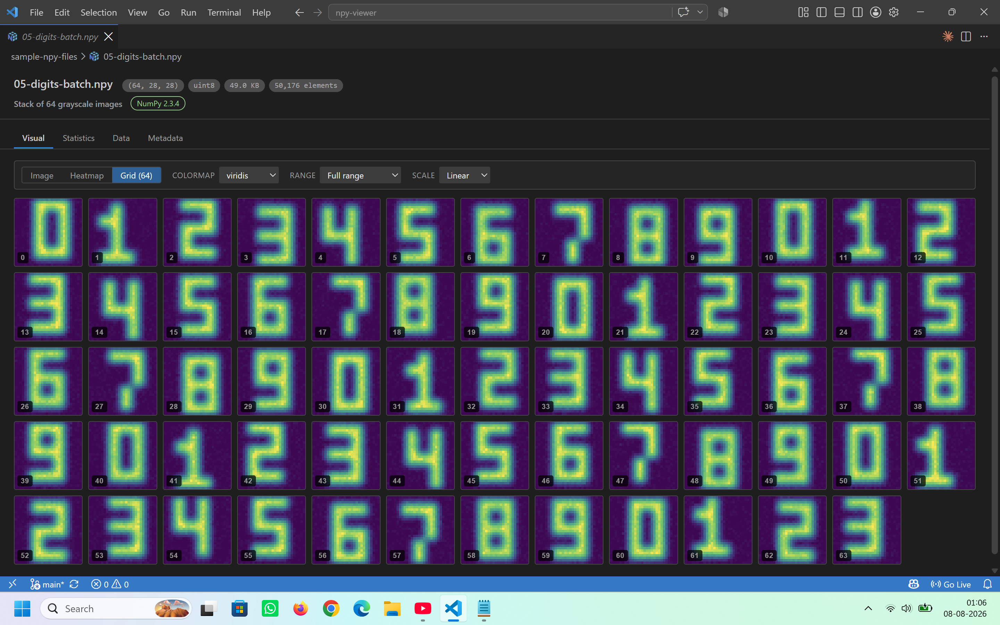
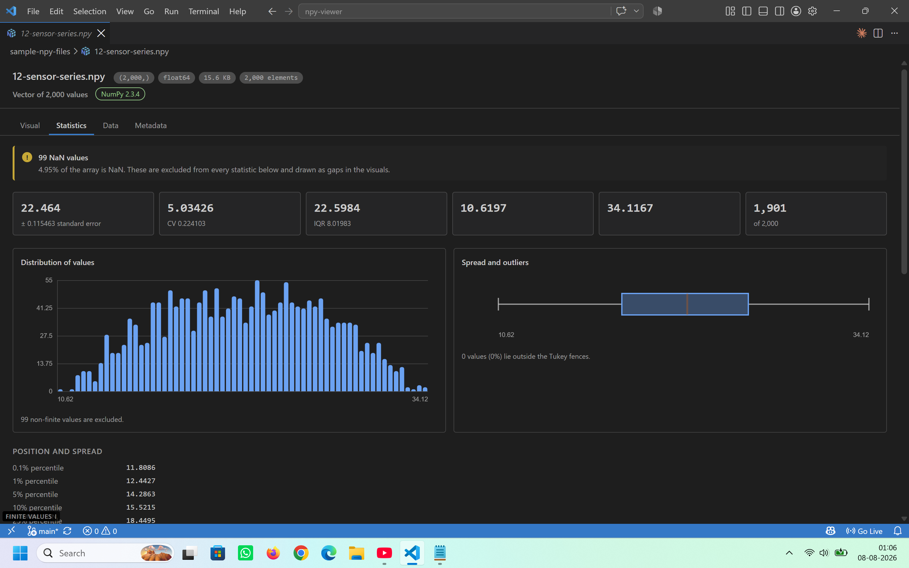
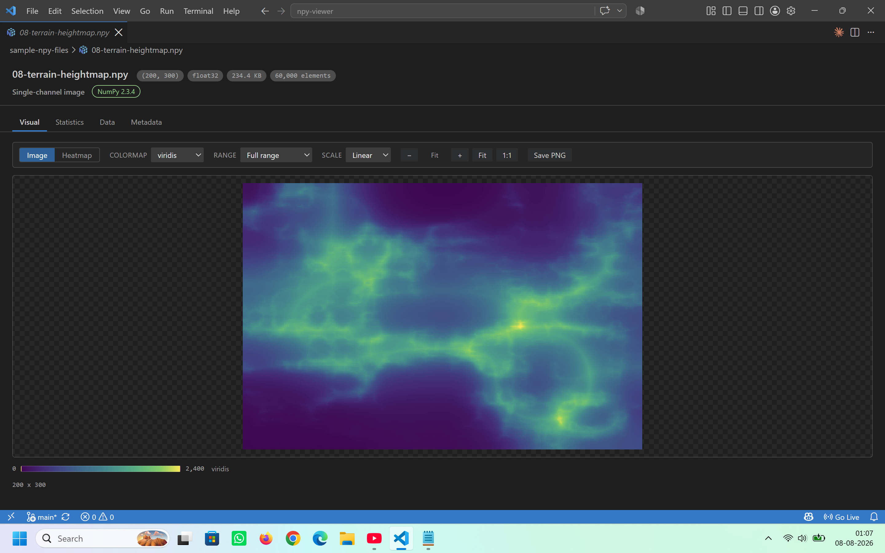
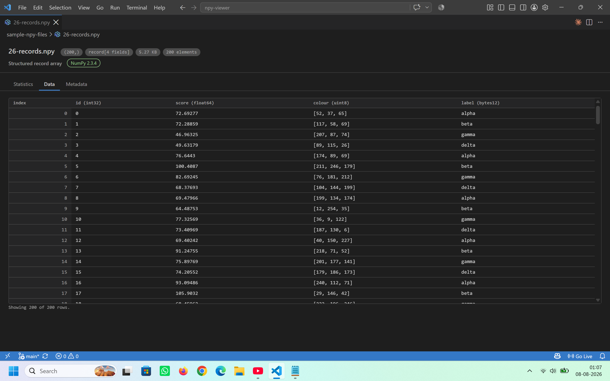

# NPY Viewer

Open a `.npy` file in VS Code and see it — as an image, a heatmap, a contact
sheet of frames, a plot, or a table of exact values — alongside the descriptive
statistics you would otherwise write a script to get.

Click any `.npy` file in the Explorer. There is nothing to configure and no
Python required.

## What it looks like

An `(H, W, 3)` uint8 array is a photograph, so it is drawn as one:



A `(64, 28, 28)` stack becomes a contact sheet — click any tile to open that
frame:



Every array gets the statistics you would otherwise write a script for, led by
the observations worth noticing first:



Heatmaps come with eight colormaps, three normalisation ranges, and log or
symlog scaling for data with a wide dynamic range:



Structured and non-numeric dtypes fall back to an exact table, one column per
record field:



## What it does

**Works out what the array is.** The viewer reads the shape and dtype and picks
a presentation from them:

| Shape                                 | Read as                                                     |
| ------------------------------------- | ----------------------------------------------------------- |
| `(H, W, 3)` / `(H, W, 4)`             | RGB / RGBA image                                            |
| `(3, H, W)`                           | Channel-first image, the PyTorch convention                 |
| `(N, H, W)`                           | Stack of `N` grayscale frames                               |
| `(N, H, W, C)` / `(N, C, H, W)`       | Image batch, NHWC or NCHW                                   |
| `(H, W, B)` where `B` is much smaller | `B` bands over one `H x W` plane                            |
| `(H, W)`                              | Image when it looks like one, otherwise a heatmap or matrix |
| `(N,)`                                | Line plot, with a histogram in the statistics tab           |
| 5-D and beyond                        | Frame navigator over the two trailing axes                  |
| `object`, `str`, `bytes`, records     | Table of values                                             |

Where channel-first and channel-last are both plausible, the toolbar offers a
switch rather than guessing silently.

**Shows the statistics.** Count, mean, standard deviation, variance, standard
error, min, max, range, sum, L1/L2 norms, median, eleven percentiles, IQR,
median absolute deviation, Tukey fences and outlier count, skewness, excess
kurtosis, coefficient of variation, sparsity, distinct-value count and the most
frequent values — plus a histogram, a box plot, and per-channel or per-column
breakdowns. NaN, ±infinity, zeros, negatives and positives are counted
separately and kept out of the moments.

Above all of it sits a short list of plain-language observations: whether the
data is standardised or normalised, whether it is skewed or heavy-tailed, how
much of it is missing, whether the classes are imbalanced, whether a log colour
scale would show more.

**Opens files bigger than memory.** Arrays over 96 MB are streamed from disk
rather than loaded. Statistics run in a single sequential pass; the visuals are
decimated to a bounded size before they cross into the view; the data table
reads exact values on demand. A multi-gigabyte array opens without VS Code
stalling.

## Views

- **Visual** — image, heatmap, contact sheet or line, with eight colormaps,
  linear/log/symlog scaling, three normalisation ranges, frame navigation, zoom,
  a live value readout under the cursor, and PNG export.
- **Statistics** — the numbers above, with hover on every chart.
- **Data** — a paged, sticky-headed grid of exact values, with optional value
  shading, copy, and CSV export.
- **Metadata** — shape, dtype, byte order, memory order, format version, header
  size, record fields, and which backend parsed the file.

Signed data automatically gets a diverging colour ramp centred at zero; 8-bit
imagery is drawn at its native range; float imagery in `[0, 1]` or `[-1, 1]` is
recognised as such.

## Python is optional

The built-in TypeScript parser handles every standard dtype — `bool`, all
integer and float widths including `float16`, `complex64/128`, `datetime64`,
`timedelta64`, fixed-width strings and bytes, structured records, big-endian
data and Fortran ordering — with no Python installed.

If a Python interpreter with NumPy is available, it is used for the analysis
pass instead. That adds two things the built-in parser cannot do:

- reading arrays of **pickled Python objects** (`allow_pickle=True`), and
- **exact medians and percentiles** on arrays too large to hold in memory, where
  the built-in parser falls back to a uniform random sample.

On ordinary numeric arrays the two are comparably fast, and the statistics they
produce agree. The viewer says which one ran in the header and the Metadata tab.

Interpreters are looked for in this order: the `npyViewer.python.path` setting,
the interpreter selected in the Python extension, then `python3` / `python` /
`py` on `PATH`.

Because launching an interpreter is the only thing this extension does that runs
code, it is fenced off in two ways. `npyViewer.python.path` and
`npyViewer.python.enabled` are **machine-scoped**, so they can only be set in
your own user or remote settings — a folder you open can never choose which
executable gets launched. And in a workspace you have not trusted, the backend
is not started at all; the built-in parser handles the file instead.

## Settings

| Setting                                | Default   | Effect                                                           |
| -------------------------------------- | --------- | ---------------------------------------------------------------- |
| `npyViewer.python.enabled`             | `true`    | Use NumPy for analysis when available _(machine-scoped)_         |
| `npyViewer.python.path`                | `""`      | Explicit interpreter path; empty auto-detects _(machine-scoped)_ |
| `npyViewer.python.showInstallHint`     | `true`    | Show the hint when falling back                                  |
| `npyViewer.preview.maxElements`        | `2000000` | Cap on elements sent to the view                                 |
| `npyViewer.preview.imageMaxSide`       | `1600`    | Longest edge of an image preview                                 |
| `npyViewer.stats.exactPercentileLimit` | `5000000` | Above this, quantiles are sampled                                |
| `npyViewer.stats.histogramBins`        | `64`      | Histogram bin count                                              |
| `npyViewer.view.colormap`              | `viridis` | Default colormap                                                 |
| `npyViewer.view.autoNormalize`         | `true`    | Stretch float imagery to its own range                           |

## Commands

- **NPY: Open with NPY Viewer**
- **NPY: Select Python Interpreter for Parsing**
- **NPY: Show Parsing Backend Info**
- **NPY: Reload Array**

## Scope and limits

`.npy` only. `.npz` archives are not opened — extract the member arrays first.
The viewer is read-only; it never writes to the file.

A few things worth knowing rather than discovering:

- **Counts, extrema, mean and standard deviation are always exact**, over every
  element, however large the array. The median, percentiles, histogram and
  distinct-value count come from a uniform random sample once the array exceeds
  `stats.exactPercentileLimit`, and are labelled _approximate_ when they do.
- **`int64` and `uint64` values beyond 2⁵³** cannot be held exactly in a
  double, so statistics over them carry a small relative error — as they would
  in any float64 computation, NumPy's included. The data table reads such values
  through a separate exact path and shows every digit.
- **`float128` and nested record dtypes** get statistics and a text preview but
  no interactive visual; neither has a JavaScript representation.
- **Complex arrays** are summarised and plotted by magnitude. The data table
  shows the full `a+bj` value.
- The **most-frequent-values breakdown** appears only when values actually
  repeat; on continuous data every value is distinct and the chart would say
  nothing the distinct count does not.

## Sample files

`sample-npy-files/` holds 37 arrays covering every view and dtype the extension
handles — a procedural photo, a batch of digits, ridged terrain, an MRI volume,
a hyperspectral cube, records, pickled objects, and the awkward edge cases.
Open any of them to see what the viewer does. `sample-npy-files/README.md`
explains what each one demonstrates, and `generate.py` regenerates them.

## Contributing

```sh
npm install
npm run watch     # rebuilds extension and webview bundles
npm test          # runs the test suite in an extension host
```

Press <kbd>F5</kbd> to launch an Extension Development Host, then open any
`.npy` file from `sample-npy-files/`. See [CONTRIBUTING.md](CONTRIBUTING.md) for
the architecture, how to verify changes against NumPy, and what a change needs
to hold to.

## Licence

[MIT](LICENSE).
